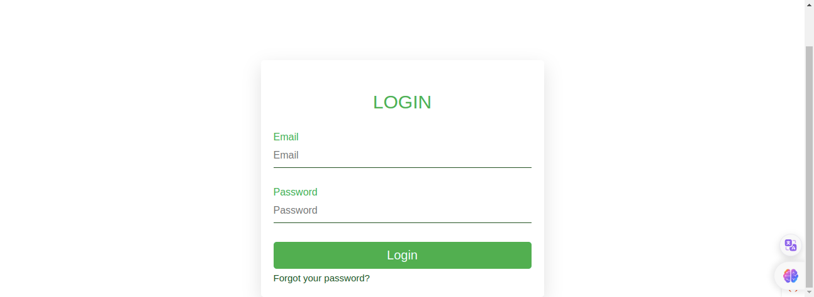

# OPEN API For Travel Agency application

__Information Access__

Destination Details: Tourism sites provide comprehensive information about various destinations, including attractions, accommodations, activities, and local culture. This helps travelers make informed decisions about where to go and what to do.
Trip Planning:

Itinerary Creation: 
Users can plan their entire trip, from choosing destinations and activities to creating detailed itineraries. Tourism sites often offer tools to organize and customize travel plans.

__Application features__ 
- Ready to deploy at server and start business.
- Logo, Site Name and Banner can be set according to business.
- Admin Panel for adding/editing trips, manage Customers, Track bookings and activities.
- Ready made API Collection for Frontend web or Mobile APP.  
- Contents can be provided by API.
- Razorpay Payment Gateway for husslefree payment processing.
- Contents available for About Us, Announcements, Privacy Policy, Travel blogs, Contact us page etc.
- No save card policy and secure payment guarantee.
# Grow your tourism


## Payment Gateway


## Installation & updates (Directly at Server)
```sh
$ git clone https://github.com/sagnikcapital/Open-Api-Travel-Application.git
```
```sh
$ cp .env.example .env
```
```sh
$ composer install
```
```sh
$ chmod +x Permission.sh
```
```sh
$ chmod +x Deploy.sh
```
```sh
$ crontab -e
```
> Write the execution details at cron tab: 

```sh
0 2 * * * /path/to/your/script/Permission.sh
```
```sh
0 2 * * * /path/to/your/script/Deploy.sh
```
> Write the .htaccess
```sh
$ cp public/.htaccess .
```


> Setup .env configuration for Database connect
```env
HOST=''
DB_USER=''
DB_PASSWORD=''
DB_NAME=''
PORT=3306
```
> Set the Value of CI_ENVIRONMENT
```env
CI_ENVIRONMENT='production'
```

> Run migrations
```sh
$ php spark migrate
```
> Seed the Admin details and Content to Database
```sh
$ php spark db:seed AdminSeeder
```
```sh
$ php spark db:seed ContentsSeeder
```

> Setup Twilio details at .env for Messaging
```env
TWILIO_SID=''
TWILIO_AUTH_TOKEN=''
```

> Set the App Url at .env with domain like this
```env
APP_URL='http://domain.com/api/'
```
> Configure the SMTP Details at .env for Mailing
```env
SMTP_HOST=''
SMTPUSER=''
SMTPPASS=''
SMTP_PORT=587
SMTP_LEVEL='tls'
MAIL_FROM=''
MAIL_NAME='your name'
```
> Configure Razorpay  Payment Gateway Details in .env file
```env
RAZORPAY_API_KEY=''
RAZORPAY_API_SECRET=''
RAZORPAY_CURRENCY='USD' #'INR', 'IDR', 'EUR', 'EGP', 'GHS'
```
- Refer: https://github.com/razorpay/razorpay-php

> Add JWT key to .env, refer this 
- URL: https://auth0.com/signup?&signUpData=%7B%22category%22%3A%22docs%22%7D
```env
JWT_SECRET_KEY=''
```

> Run to confirm setup process
```sh
$ php spark setup
```

## Server Maintenance Mode
> For put your application into maintenance mode you can use following
```sh
$ php spark mm:down
```
> For check status
```sh
$ php spark mm:status
```
> To Put application live again after being in maintenance mode
```sh
$ php spark mm:up
```
- Refer: https://github.com/arashsaffari/maintenancemode

## Check System Logs
> Open http://your-domain/logs in browser
- Refer: https://github.com/SeunMatt/codeigniter-log-viewer 
## Important Change with index.php

`index.php` is no longer in the root of the project! It has been moved inside the *public* folder,
for better security and separation of components.

This means that you should configure your web server to "point" to your project's *public* folder, and
not to the project root. A better practice would be to configure a virtual host to point there. A poor practice would be to point your web server to the project root and expect to enter *public/...*, as the rest of your logic and the
framework are exposed.

## Versions and Compatibility

- [PHP 7.4 | 8.0]()
- [Apache 2]()
- [CodeIgniter 4.0]()
- [Mysql]()
- [intl](http://php.net/manual/en/intl.requirements.php)
- [mbstring](http://php.net/manual/en/mbstring.installation.php)
- [DomPDF](https://github.com/dompdf/dompdf/releases)
- [json]() (enabled by default - don't turn it off)
- [mysqlnd](http://php.net/manual/en/mysqlnd.install.php) if you plan to use MySQL
- [libcurl](http://php.net/manual/en/curl.requirements.php) if you plan to use the HTTP\CURLRequest library

## Admin Access
> Username : admin@admin.com  
> Password : password1234

> URL: /admin/login


## API  Documentation
| API URL                 | Parameters          | Method   |
|-------------------------|---------------------|----------|
| `api/login`             | `phone, otp_code`   | POST     |
| `api/register`          | `phone, email`      | POST     |
| `api/otp`               | `phone`             | POST     |
| `api/validate-otp`      | `phone, otp_code`   | PUT      |
| `api/content/headers`   |  NULL               | GET      |
| `api/content/get/{title}`| `title`            | GET      |
| `api/content/logo`      |  NULL               | GET      |
| `api/trips`             |  NULL               | GET      |
| `api/trip/{id}`         | `id`                | GET      |
| `api/trip/search`       | `keyword`           | POST     |
| `api/trip/review`       | `trip_id, user_id, review{int}, comment{text}`  | POST |
| `api/trip/my-trips`     | `user_id`           | GET      |
| `api/trip/confirm`      | `user_id, trip_id, date`| POST |
| `api/trip/cancel`       | `booking_code, trip_id, reason {text}, invoiceNumber`    | DELETE  |
| `api/make/payment`      | `amount, user_id, phone, trip_id` | POST |

With Best regards,
 ### Sagnik Dey

 ---
## 💻 Tech Stack
                    
      


